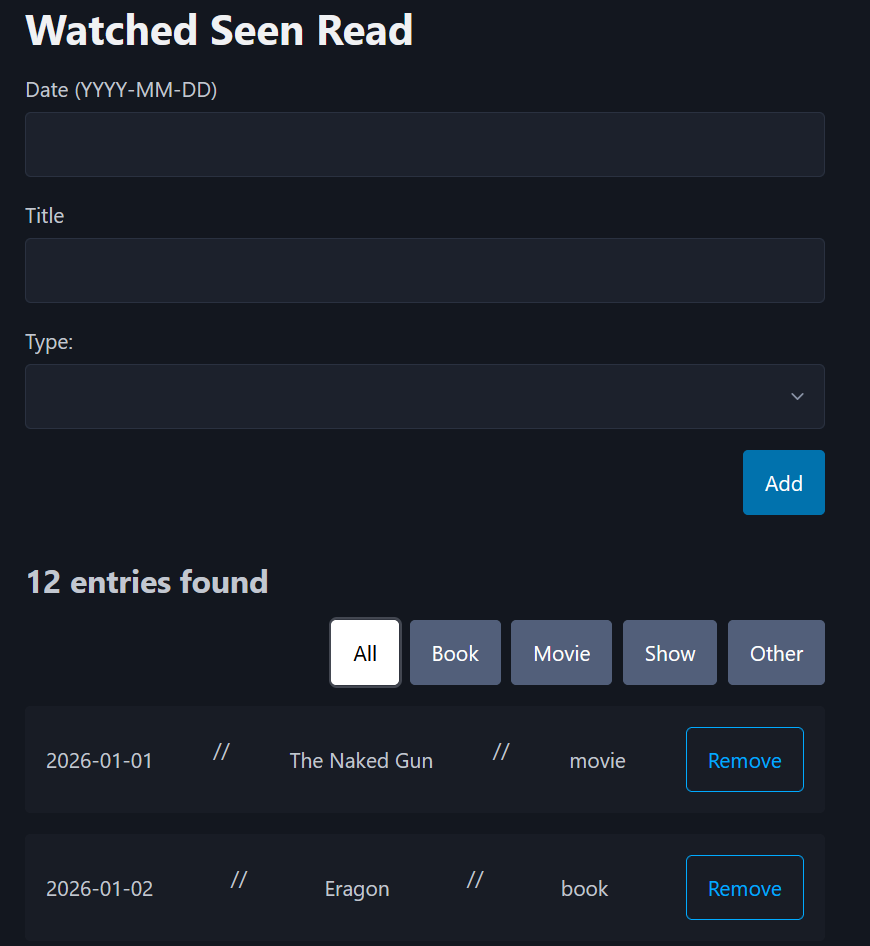

# Watched Seen Read

## Motivation

Inspired by Steven Soderbergh's yearly Seen, Read blog post, I set out to create a small web app I can use to track my own list for the year. I've traditionally just
tracked this in a Google Sheet, but thought it would be fun to turn it into a web app so multiple years can be stored and entries can be filtered for easier viewing.

## Usage



## Technologies Used

Go\
Vue\
TypeScript\
PostgreSQL

## How It Works

Using the app is pretty straight forward, you use the form to enter what you've watched, seen, or read, the date it was completed, and what type of entry it is,
then hit Submit. The data gets saved to the PostgreSQL database, and the Entry List fetches table and displays the updated data. There are filter buttons to filter
the list down to a specific entry type.

## Quick Start

### Clone the Repository

```
git clone https://github.com/hardiing/watched-seen-read.git
cd watched-seen-read
```

### Running The App

If you are just using the application, you can just use docker compose commands while running [Docker Desktop](https://www.docker.com/products/docker-desktop/) (if on Windows/Mac) or [Docker Engine](https://docs.docker.com/engine/) (if on Linux).

Up:

```
docker compose up --build
```

Once the containers are running, open http://localhost:8080\

Down:

```
docker compose down
```
